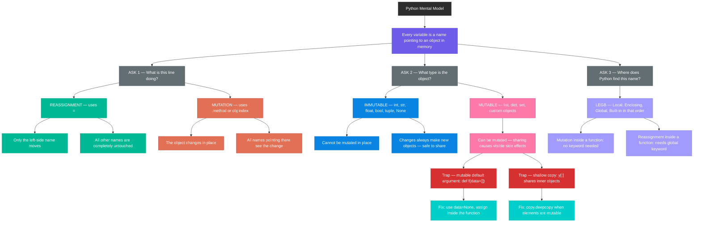

# Python's Object Model — A Progressive Guide

---

## The One Idea That Unlocks Everything

> **A variable is not a box. It is a sticky note attached to an object.**

In most languages you learn first, a variable stores a value directly — like a labelled box with something inside it.
Python is different. In Python, objects live in memory on their own. Variable names are just sticky notes you attach to those objects. The note does not contain the object. The note points to it.

Hold onto this. Every confusing thing in Python — shared references, scope, mutable defaults, shallow copies — is just this one idea appearing in a new situation.

---

## Chapter 1 — Names and Objects

### What actually happens when you write `x = 5`

Python creates an integer object `5` in memory. Then it attaches the sticky note `x` to it.

```python
x = 5
```

`x` does not contain `5`. `x` points to `5`.

### What happens when you write `y = x`

Python reads where `x` is pointing. It makes `y` point to the same place.

```python
x = 5
y = x
```

Now two sticky notes are on the same object. There is no connection between `x` and `y` themselves. They each independently happen to be pointing at the same thing.

After `y = x`, you could move `x` to a completely different object. `y` would not follow. `y` has its own relationship with the object.

**The rule:** A name is a sticky note. It does not contain the object — it just points to it.

---

## Chapter 2 — Two Operations. That Is All.

Every line of Python code does exactly one of two things:

### Operation 1 — Reassignment

Move a sticky note to a different object.

The signal: `=` at the top level of the line.

```python
x = [1, 2]
y = x
x = [9]     # only x's note moves. y was not mentioned.
print(y)    # [1, 2]  — y is untouched
```

Read `x = [9]` literally: "make x point to [9]." Nobody said anything about `y`. So `y` does not move.

### Operation 2 — Mutation

Change the object itself.

The signal: a method call (`.append()`, `.update()`) or subscript assignment (`obj[i] = val`).

```python
x = [1, 2]
y = x
x.append(3)   # no sticky note moves. the list object itself changes.
print(y)      # [1, 2, 3]  — y also sees the change
```

No sticky note moved. The list changed. Since `y` is also pointing at that same list, `y` also sees `[1, 2, 3]`.

### The question to ask for any line of code

> Does this move a sticky note to a new object, or does this change an existing object?

If it uses `=` at the top level → reassignment. One note moves.
If it uses a method or subscript → mutation. The object changes. All notes pointing there see it.

---

## Chapter 3 — Mutable vs Immutable

Not all objects can be mutated. This is the divide that matters most in Python.

### Immutable objects — cannot be changed in place

`int`, `float`, `str`, `tuple`, `bool`, `None`

Try to mutate a string and Python refuses:

```python
s = "hello"
s[0] = "H"    # TypeError: 'str' object does not support item assignment
```

When you appear to "change" an immutable, Python secretly makes a brand new object and moves your sticky note to it. The original object is untouched.

```python
x = 5
x += 1
# x now points to a new object, 6. The old 5 is still in memory.
```

This is why immutables never cause surprise sharing bugs. You cannot mutate them, so sharing them between two names is always safe.

### Mutable objects — can be changed in place

`list`, `dict`, `set`

These can be mutated. This is where the surprises happen.

```python
a = [1, 2]
b = a          # two notes, one object
b.append(3)    # mutate the object
print(a)       # [1, 2, 3]  — a saw the change through the shared object
```

### Why this matters in practice

Whenever you see two names pointing to the same mutable object, changing the object through either name affects the other. This is not a bug — it is how Python works. You just need to be aware of when it is happening.

**The rule:** Sharing an immutable object is always safe. Sharing a mutable object means mutations are visible everywhere.

---

## Chapter 4 — Scope: Where Python Looks for Names

When Python sees a name, it searches for it in this exact order:

1. **L**ocal — inside the current function
2. **E**nclosing — inside any outer function wrapping this one
3. **G**lobal — at the top of the file
4. **B**uilt-in — Python's own names like `len`, `print`, `range`

Python stops and uses the first match it finds. This is called the **LEGB rule**.

```python
x = "global"

def f():
    print(x)    # not found locally, found globally

f()    # prints "global"
```

### Mutation does not need `global`

Inside a function, you can freely mutate a global mutable object. Mutation changes the object itself — no sticky note moves, so Python does not need to know which scope to update.

```python
items = [1, 2]

def add(val):
    items.append(val)    # no 'global' keyword needed

add(3)
print(items)    # [1, 2, 3]
```

### Reassignment does need `global`

If you try to reassign a global name inside a function, Python assumes you mean a new local name. The global is untouched unless you explicitly declare it.

```python
count = 0

def increment():
    count = count + 1    # NameError — Python sees a local 'count' being used before assignment

def increment_fixed():
    global count         # now Python knows to update the global
    count = count + 1
```

**The rule:** Inside a function, you can mutate globals freely. To reassign a global name, you must declare it with `global`.

---

## Chapter 5 — Functions, Arguments, and Scope

When you call a function, Python creates a fresh local scope. Each parameter is just a new local sticky note pointing to whatever you passed in.

```python
def show(val):
    print(val)    # val and the caller's variable point to the same object

x = [1, 2]
show(x)           # val temporarily points to the same list as x
```

### Immutable arguments — always safe

Since you cannot mutate them, nothing unexpected happens.

```python
def triple(n):
    n = n * 3    # reassignment — moves the local note 'n'. caller unchanged.
    return n

x = 5
triple(x)
print(x)    # still 5
```

### Mutable arguments — be careful

The local parameter and the caller's variable start by pointing to the same object. A mutation inside the function is visible outside.

```python
def add_zero(lst):
    lst.append(0)    # mutates the shared object

my_list = [1, 2]
add_zero(my_list)
print(my_list)    # [1, 2, 0]  — the caller's list was mutated
```

If you want to protect the caller's object, make a copy at the start of the function:

```python
def add_zero_safe(lst):
    lst = lst[:]      # reassignment — lst now points to a new copy
    lst.append(0)
    return lst

my_list = [1, 2]
result = add_zero_safe(my_list)
print(my_list)    # [1, 2]  — untouched
print(result)     # [1, 2, 0]
```

**The rule:** Arguments are local notes pointing to the same objects as the caller. Reassign the parameter if you need your own copy. Mutate it and the caller will feel it.

---

## Chapter 6 — The Mutable Default Trap

This is one of the most common Python interview questions.

Default argument values are evaluated **once**, when Python first reads the `def` line. Not once per call.

```python
def f(x, data=[]):
    data.append(x)
    return data

print(f(1))    # [1]
print(f(2))    # [1, 2]  ← most people expect [2]
print(f(3))    # [1, 2, 3]
```

The `[]` in `data=[]` is one list object, created when Python first saw the `def` line. It lives inside the function object itself. Every call that does not pass a `data` argument gets the same stored list. `.append()` is mutation — it changes the stored list, and it never gets reset between calls.

You can see the stored default yourself:

```python
print(f.__defaults__)    # ([1, 2, 3],)  — the actual object stored on the function
```

### Why the trap exists

If the default were immutable — say `data=0` — this would not be a problem. You cannot mutate an integer, so the default could never grow. But lists are mutable, and so the default list silently accumulates every call.

### The fix — use `None` as the sentinel

```python
def f(x, data=None):
    if data is None:
        data = []       # reassignment inside the function — fresh list every time
    data.append(x)
    return data

print(f(1))    # [1]
print(f(2))    # [2]  ← correct now
```

`None` is immutable and safe to share as a default. Inside the function, `data = []` is a reassignment — it creates a brand new list on every call that needs one.

**The rule:** Never use a mutable object as a default argument. Use `None` and create the object inside.

---

## Chapter 7 — Shallow Copy vs Deep Copy

`y[:]` creates a new list object. Your intuition that `x` and `y` point to different things is correct — at the outer level.

But a Python list is not just "a value." It is a container with numbered slots. Each slot holds a sticky note pointing to an object. When you do `y[:]`, Python creates a new container and copies those sticky notes into it. The sticky notes are copied, not the objects they point to.

### When this is fine — immutable elements

```python
y = [1, 2, 3]
x = y[:]

x.append(4)
print(y)    # [1, 2, 3]  — y unchanged, outer containers are independent
```

The integer objects `1`, `2`, `3` are shared between `y` and `x`, but since integers are immutable, nobody can mutate them. Sharing is safe.

### When this bites you — mutable elements

```python
y = [[1, 2], [3, 4]]
x = y[:]

x[0].append(99)
print(y[0])    # [1, 2, 99]  — y was affected!
```

`x[0]` and `y[0]` both hold sticky notes pointing to the same inner list `[1, 2]`. Appending to it through `x[0]` changes the shared object. `y[0]` still points there, so `y[0]` also sees `[1, 2, 99]`.

The outer containers (`x` and `y`) are separate. The inner objects they reference are shared.

### The fix — `copy.deepcopy()`

```python
import copy

y = [[1, 2], [3, 4]]
x = copy.deepcopy(y)

x[0].append(99)
print(y[0])    # [1, 2]  — y is protected
```

`deepcopy` recursively creates new objects at every level. Nothing is shared.

### How to decide which to use

| Your elements are... | Use this |
|---|---|
| Immutable (ints, strings, tuples) | `y[:]` or `list(y)` — safe |
| Mutable (lists, dicts, sets) | `copy.deepcopy(y)` — required |

**The rule:** `y[:]` gives you a new outer container with the same inner references. Use it only when the inner elements cannot be mutated. Use `deepcopy` when they can.

---

## Summary — One Table

| Concept | What it means | Code signal |
|---|---|---|
| Variable | A sticky note pointing to an object | `x = ...` |
| Reassignment | Move one sticky note to a new object. Others unaffected. | `x = new_thing` |
| Mutation | Change the object itself. Every name pointing there sees it. | `x.append()`, `x[i] = val` |
| Immutable | Object cannot be changed in place | `int`, `str`, `tuple` |
| Mutable | Object can be changed in place | `list`, `dict`, `set` |
| LEGB scope | Order Python searches for names | Local → Enclosing → Global → Built-in |
| `global` keyword | Only needed when reassigning a global name inside a function | `global x` |
| Mutable default trap | `data=[]` is one shared object across all calls | Use `data=None` instead |
| Shallow copy | New outer container, same inner references | `y[:]` or `list(y)` |
| Deep copy | New objects at every level, nothing shared | `copy.deepcopy(y)` |

---

## Interview Checklist

When you see confusing Python code, ask these five questions in order:

1. What objects exist in memory right now?
2. Which names are pointing to which objects?
3. Does this line move a name (reassignment) or change an object (mutation)?
4. Are the objects involved mutable or immutable?
5. Are multiple names pointing to the same mutable object?

If you can answer these five questions about any piece of code, you can explain any Python behaviour.

---

## Mental Model — Full Hierarchy

The three branches below map directly to the three questions in the checklist above. When reading any Python code, trace from the top down: foundation → operation → type → consequences.

